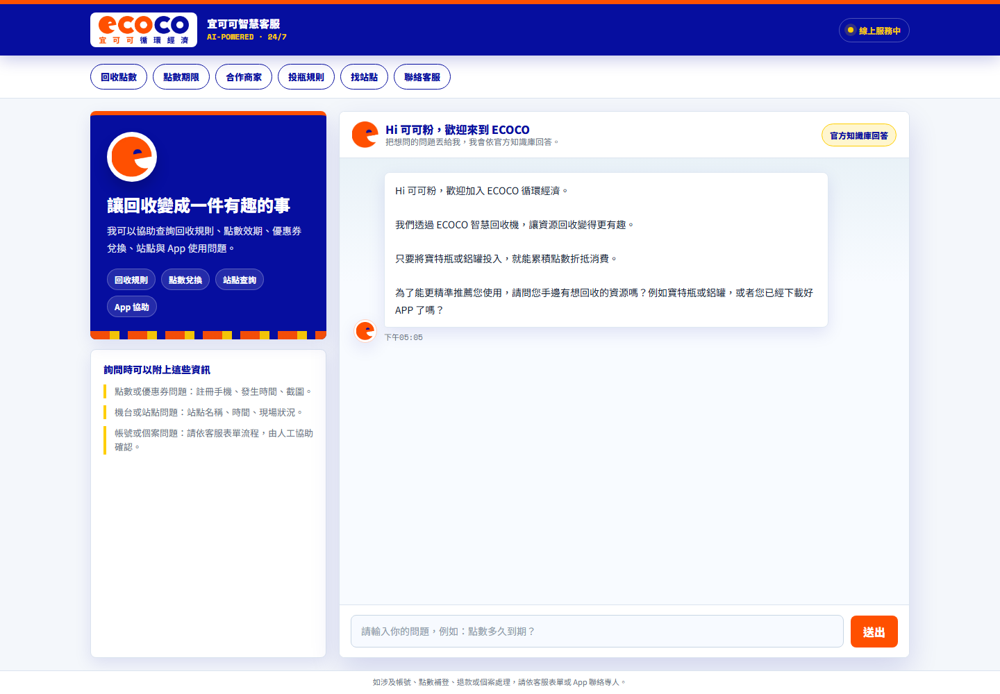
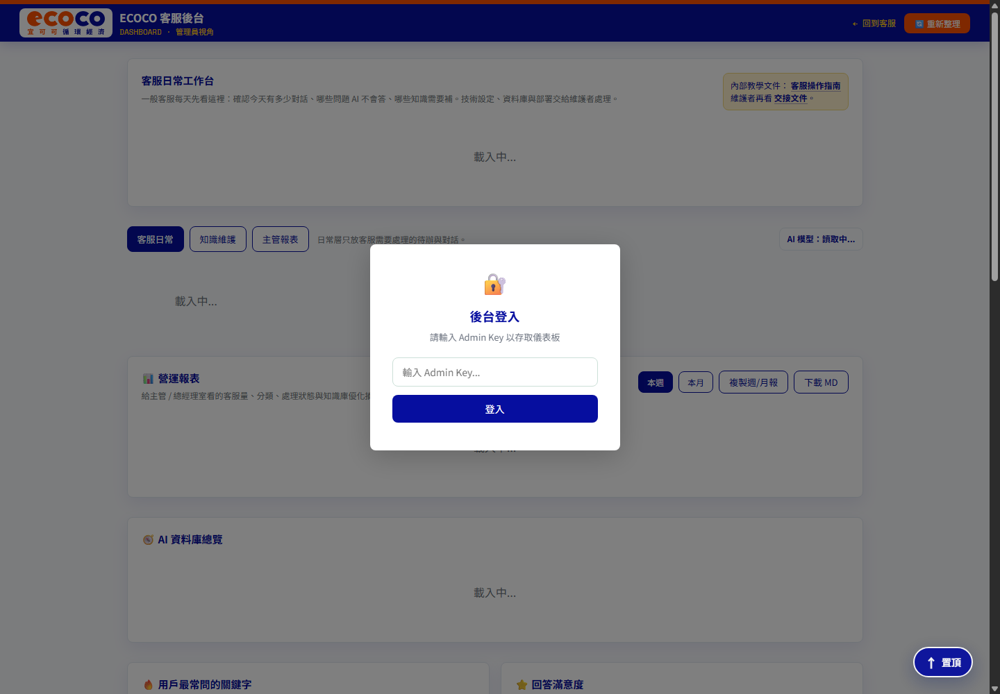
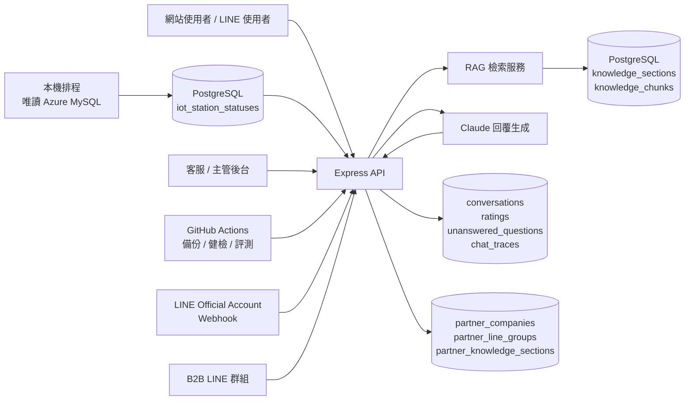

# ECOCO AI 客服系統

[](https://github.com/jameswu504-hash/ecoco-customer-servic/actions/workflows/ci.yml)

ECOCO AI 客服系統是一套以官方知識庫為核心的客服輔助與自動回覆服務。系統支援網站客服、客服後台、PostgreSQL 知識庫、RAG 檢索、知識缺口紀錄、使用者回饋、主管報表、LINE Official Account Webhook，以及依 LINE 群組隔離的 B2B 合作夥伴分支。正式維運自動化以 GitHub Actions 為準。

本專案目標不是另外建立一套分散的 FAQ，而是讓網站、後台與未來 LINE@ 回覆共用同一份知識庫與同一套風險控管規則。

## 快速展示

- Live demo：[ECOCO 智慧客服前台](https://ecoco-customer-servic.onrender.com/)
- 管理後台：[ECOCO 客服後台](https://ecoco-customer-servic.onrender.com/dashboard.html)（需 `ADMIN_KEY`）
- B2B 合作夥伴管理：[ECOCO B2B 管理頁](https://ecoco-customer-servic.onrender.com/partners.html)（需 `ADMIN_KEY`）
- 健康檢查：[healthz](https://ecoco-customer-servic.onrender.com/healthz)

### 前台客服畫面



### 管理後台畫面



### 架構圖



## 目前狀態

- 網站 AI 客服可依 ECOCO 官方知識庫回答常見問題。
- 後台可維護 `knowledge_sections`，新增或封存知識後會重建 RAG chunks。
- 支援 pgvector / embedding 語意檢索；若 OpenAI embedding 失敗，會降級為關鍵字檢索。
- 對話、評分與知識缺口會寫入 PostgreSQL。
- LINE Messaging API Webhook 已串接；一對一訊息走 B2C，已綁定群組走公司隔離的 B2B 分支。
- B2B 管理頁可在尚未綁定真實 LINE 群組前，先建立公司、加入測試資料與模擬問答。
- GitHub Actions 為目前正式維運自動化方式，負責 CI、知識庫備份與每週 AI 維運分析。

## 系統架構

```text
使用者網站 / LINE@
  -> Express API
  -> PostgreSQL knowledge_sections / knowledge_chunks
  -> RAG 檢索與風險規則
  -> Claude API 產生回覆
  -> conversations / ratings / unanswered_questions
  -> 客服後台與營運報表
```

| 模組 | 用途 |
| --- | --- |
| `server.js` | Express 啟動入口、安全標頭、健康檢查與 route 掛載 |
| `routes/` | 各 API 路由：客服對話、後台、知識庫、報表、LINE |
| `services/` | RAG、prompt、報表與隱私遮罩 |
| `db/schema.js` | PostgreSQL schema 初始化 |
| `public/index.html` | 對外客服前台 |
| `public/dashboard-v2.html` | 管理後台實際 shell；公開入口仍為 `/dashboard.html` |
| `public/partners.html` | ECOCO 管理者使用的 B2B 公司、群組綁定與分支測試頁 |
| `data/ecoco-knowledge-import.json` | 正式匯入 PostgreSQL 的知識庫 JSON |
| `data/ecoco-ai-customer-service-database.json` | 整合來源資料與稽核用資料庫 |
| `.github/workflows/` | GitHub Actions 自動備份與健檢，為正式維運主線 |

## 必要環境變數

正式部署時，密鑰只放在 Render Environment Variables 或 GitHub Secrets，不得寫入 Git。

| 變數 | 必填 | 用途 |
| --- | --- | --- |
| `DATABASE_URL` | 是 | PostgreSQL / Neon 連線字串 |
| `ANTHROPIC_API_KEY` | 是 | Claude 回覆生成 |
| `ANTHROPIC_MODEL` | 選填 | 覆蓋預設 Claude 模型 |
| `ADMIN_KEY` | 是 | 後台與管理 API 存取 |
| `OPENAI_API_KEY` | 選填 | embedding / pgvector 語意檢索 |
| `EMBEDDING_MODEL` / `EMBEDDING_DIMENSIONS` | 選填 | embedding 模型與向量維度 |
| `EMBEDDING_BATCH_SIZE` / `EMBEDDING_TIMEOUT_MS` | 選填 | embedding 批次量與 timeout |
| `PGSSL` | 選填 | 預設 `verify-full`，加密並驗證憑證；`require` 只加密；本機可信環境才用 `disable` |
| `APP_MODE` | 建議 | 正式客服使用 `customer`；`internal` 才啟用內部 Wiki API |
| `STAFF_KEY` | internal 模式需要 | 內部 Wiki API 權限，不得與 `ADMIN_KEY` 共用 |
| `CONVERSATION_RETENTION_DAYS` | 建議 | 對話紀錄保存天數，建議 `180` |
| `KNOWLEDGE_AUTO_SYNC` | 選填 | 是否啟動時從 Git JSON 同步知識庫 |
| `REBUILD_KNOWLEDGE_CHUNKS_ON_START` | 選填 | 是否啟動時強制重建 RAG chunks |
| `LINE_CHANNEL_SECRET` | LINE 上線需要 | 驗證 LINE Webhook |
| `LINE_CHANNEL_ACCESS_TOKEN` | LINE 上線需要 | 呼叫 LINE Reply API |
| `ECOCO_IOT_MYSQL_*` | 本機同步需要 | 本機/VPN 連唯讀 Azure MySQL；不要設定在 Render，完整清單見 `.env.example` |
| `ECOCO_IOT_SYNC_URL` / `ECOCO_IOT_SYNC_ADMIN_KEY` | 本機同步需要 | 將站點快照上傳 Render 管理 API；可由本機加密設定提供 |

## 本機開發

```bash
npm install
copy .env.example .env
npm start
```

本機預設入口：

| 頁面 | URL |
| --- | --- |
| 客服前台 | `http://localhost:3000` |
| 管理後台 | `http://localhost:3000/dashboard.html` |
| B2B 合作夥伴管理 | `http://localhost:3000/partners.html` |
| 健康檢查 | `http://localhost:3000/healthz` |
| 詳細系統狀態 | `http://localhost:3000/api/system/status`，需 `x-admin-key` |

## 常用指令

```bash
npm run lint
npm test
npm run scan:pii
npm run build:knowledge
npm run audit:knowledge
```

上線或交接前至少執行：

```bash
npm run lint
npm test
npm run scan:pii
git diff --check
```

## 知識庫維護流程

1. 客服或維護者在後台新增、修改或封存知識。
2. PostgreSQL 立即更新，AI 回覆會使用最新知識。
3. 大改版、交接或備份前，在後台下載 JSON。
4. 人工確認 JSON 後，覆蓋 `data/ecoco-knowledge-import.json`。
5. commit / push，讓 Git 成為正式版本紀錄。

注意：後台下載 JSON 只是把 PostgreSQL 目前狀態匯出成檔案，不會自動寫回 GitHub。

## LINE@ 串接方式

本專案採用 LINE Official Account Messaging API，不使用 LINE 後台內建的 AI 聊天機器人作為主要客服入口。

正式串接流程：

1. 公司提供 LINE Developers Messaging API Channel 權限。
2. 將 `LINE_CHANNEL_SECRET` 與 `LINE_CHANNEL_ACCESS_TOKEN` 設定到 Render。
3. 在 LINE Developers 設定 Webhook URL：

```text
https://ecoco-customer-servic.onrender.com/api/line/webhook
```

4. 啟用 Webhook 並按 Verify。
5. 用測試帳號傳訊息，確認 AI 回覆、對話紀錄與知識缺口都正常。
6. 檢查 LINE OA 內建自動回覆，避免和本系統重複回覆。

與客服、主管或 LINE OA 管理者討論時，請先使用 [`docs/LINE_ROLLOUT_CHECKLIST.md`](docs/LINE_ROLLOUT_CHECKLIST.md)；技術設定細節請見 [`docs/LINE_INTEGRATION_GUIDE.md`](docs/LINE_INTEGRATION_GUIDE.md)。

## 維運文件

| 文件 | 用途 |
| --- | --- |
| [`docs/README.md`](docs/README.md) | 內部文件索引 |
| [`docs/ARCHITECTURE.md`](docs/ARCHITECTURE.md) | 系統架構與主要選型說明 |
| [`docs/CUSTOMER_ROLLOUT_GUIDE.md`](docs/CUSTOMER_ROLLOUT_GUIDE.md) | 客服落地討論指南，供客服、主管與營運確認實際使用流程 |
| [`docs/CUSTOMER_SUPPORT_GUIDE.md`](docs/CUSTOMER_SUPPORT_GUIDE.md) | 客服人員後台操作指南 |
| [`docs/CUSTOMER_SERVICE_FLOW.md`](docs/CUSTOMER_SERVICE_FLOW.md) | 客服問答、RAG、站點資料與人工處理流程 |
| [`docs/MAINTENANCE_GUIDE.md`](docs/MAINTENANCE_GUIDE.md) | 日常維護、知識缺口狀態與檢查重點 |
| [`docs/OPERATIONS_HANDOFF_GUIDE.md`](docs/OPERATIONS_HANDOFF_GUIDE.md) | 維護與交接總整理 |
| [`docs/DEPLOYMENT_RUNBOOK.md`](docs/DEPLOYMENT_RUNBOOK.md) | Render 部署、環境變數與故障排查 |
| [`docs/archive/GO_LIVE_CHECKLIST.md`](docs/archive/GO_LIVE_CHECKLIST.md) | 上線前檢查表 |
| [`docs/LINE_ROLLOUT_CHECKLIST.md`](docs/LINE_ROLLOUT_CHECKLIST.md) | LINE@ 串接落地清單，列出權限、資源與測試項目 |
| [`docs/LINE_INTEGRATION_GUIDE.md`](docs/LINE_INTEGRATION_GUIDE.md) | LINE@ 技術串接說明 |
| [`docs/B2B_LINE_PARTNER_FRAMEWORK.md`](docs/B2B_LINE_PARTNER_FRAMEWORK.md) | 單一 LINE OA 的 B2B 公司分支、群組綁定與資料隔離 |
| [`docs/EVAL_OBSERVABILITY_GUIDE.md`](docs/EVAL_OBSERVABILITY_GUIDE.md) | 回覆品質評測、chat traces 與知識漂移檢查 |
| [`docs/IOT_STATION_STATUS_HANDOFF_2026-07-24.md`](docs/IOT_STATION_STATUS_HANDOFF_2026-07-24.md) | IoT 站點同步架構、排程、驗證與排錯 |
| [`docs/LIVE_IOT_MYSQL_INTEGRATION.md`](docs/LIVE_IOT_MYSQL_INTEGRATION.md) | MySQL 到 PostgreSQL/Neon 的欄位與實作說明 |
| [`docs/DATA_DICTIONARY.md`](docs/DATA_DICTIONARY.md) | PostgreSQL 與 JSON 欄位說明 |
| [`docs/DATA_SOURCES.md`](docs/DATA_SOURCES.md) | 知識來源與資料治理說明 |
| [`docs/PRD_ECOCO_AI_CUSTOMER_SERVICE.md`](docs/PRD_ECOCO_AI_CUSTOMER_SERVICE.md) | 產品需求文件 |
| [`docs/future/internal-wiki/README.md`](docs/future/internal-wiki/README.md) | 未啟用的內部 Wiki / 員工訓練知識系統規劃 |

## Future modules

內部 Wiki / 員工訓練知識系統目前只保留規劃與受 `APP_MODE=internal` 保護的 API 雛形，尚未作為公司客服正式功能啟用。正式客服環境請維持：

```text
APP_MODE=customer
```

若未來要啟用內部知識系統，需由公司先指定使用範圍、資料來源、負責窗口與權限管理方式，再另開 Render service，使用同一個 codebase 但設定 `APP_MODE=internal` 與獨立 `STAFF_KEY`。相關規劃集中於 [`docs/future/internal-wiki/`](docs/future/internal-wiki/)。

## 安全與資料治理

- API key、database URL、Admin Key、LINE token 不得 commit 到 Git。
- 對話紀錄可能包含個資，寫入前會進行基本遮罩。
- `scan:pii` 用於檢查 repo 中是否仍有手機、email、token 等敏感資料。
- `/healthz` 只回基本狀態；詳細系統資訊需使用 Admin Key 查 `/api/system/status`。
- 後台 API 使用 `x-admin-key` 驗證。
- LINE Webhook 需驗證 `X-Line-Signature`。

## 上線判斷

目前系統已具備試營運條件。正式接入 ECOCO LINE@ 前，仍需確認：

- 公司正式 Claude / OpenAI API key 與帳務歸屬。
- 公司正式 Render / PostgreSQL / GitHub Actions 維運方式。
- LINE Developers 權限與 Webhook 設定權限。
- 客服人員是否已理解知識庫維護、知識缺口處理與 JSON 備份流程。
- 已完成小範圍測試帳號驗收，再逐步導入正式流量。
