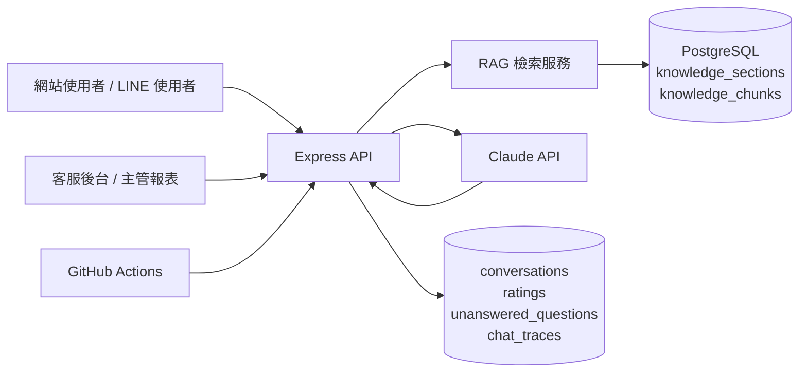

# ECOCO AI 客服系統架構

本文件說明目前系統的主要選型與維運邊界，供公司交接、主管檢視與技術維護使用。

## 核心架構

## 為什麼這樣選型

### Express API

Express 足以支撐目前客服前台、後台、LINE webhook、報表與知識庫管理。專案規模仍適合單一 Node.js service，部署到 Render 的維運成本低，對公司交接也直觀。

### PostgreSQL + RAG

知識庫正式來源以 PostgreSQL 為主，`knowledge_sections` 保存客服可維護的分類內容，`knowledge_chunks` 保存檢索片段。這樣可以讓客服後台修改後立即成為 AI 回覆依據，不需要每次都改程式碼。

系統優先使用 pgvector / embedding 做語意檢索；若 OpenAI embedding 不可用，會降級為關鍵字檢索，讓服務仍可回答基本問題。

### Claude 回覆生成

Claude 負責將 RAG 找到的公司知識轉成客服可讀的回覆。Prompt 分成固定規則與動態 RAG 內容，避免每次都重送完整知識庫，也降低模型把不存在資訊說成事實的風險。

### GitHub Actions

正式維運自動化以 GitHub Actions 為主，負責 lint、test、eval、PII scan 與知識庫備份/健檢。`n8n/workflows` 保留為未來可選整合，不是目前正式維運主線。

## 目前重要邊界

- LINE rate limit bucket 目前存在單一 Node.js 記憶體內。單一 Render instance 可用；若未來水平擴展多 instance，需改用 Redis 或 PostgreSQL。
- `knowledge.js` 只作為空資料庫初始 seed fallback；正式回覆不直接讀這份檔案。
- 內部 Wiki 仍屬未來功能，正式客服落地主線不依賴它。
- 對話紀錄會做基本遮罩後保存；這偏向隱私保護，但可能讓多輪客服情境中部分個資線索無法被模型完整沿用。

## 維護重點

- 上線前確認 Render Environment Variables 只存在正式密鑰，不提交到 Git。
- 知識庫以後台與 PostgreSQL 為主，Git JSON 匯出只作交接與備份。
- 修改客服回覆邏輯後需跑 `npm run lint`、`npm test`，並確認 GitHub Actions 通過。
- LINE webhook 若超過 reply token 時效，系統會回覆保守訊息並記錄 trace；如需主動追補訊息，需另評估 push message 成本與權限。
