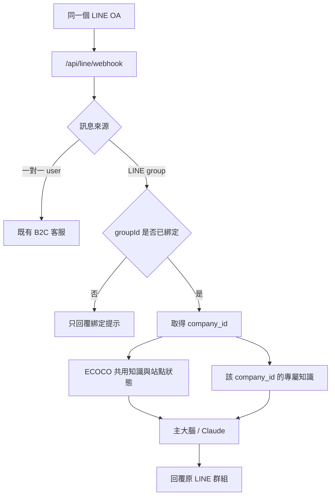

# ECOCO B2B LINE 合作夥伴框架

## 目的

同一個 ECOCO LINE Official Account 同時支援：

- 一對一聊天：維持原本 B2C 客服流程。
- 已綁定 LINE 群組：進入該合作公司的 B2B 分支。
- 未綁定 LINE 群組：只顯示綁定提示，不查詢任何 B2C 或 B2B 資料。

目前所有 `source.type = group` 的 LINE 訊息都先進入 B2B 綁定 gate；只有一對一 `user` 訊息會直接走 B2C。這是刻意的資料隔離規則，不是依群組名稱猜測用途。

合作公司不需要登入網頁。`/partners.html` 只提供 ECOCO 管理者建立公司、加入資料、產生綁定碼與模擬測試。

## 架構



「主大腦」是同一套 RAG、風險規則與 Claude；「分支」由 `company_id` 決定可讀取的資料範圍。

## 資料隔離

隔離不只依賴 prompt：

1. LINE `groupId` 先做 SHA-256，只儲存 hash 與末四碼，不保存完整 ID。
2. 每個群組綁定一個 `company_id`。
3. 公司知識與 B2B 對話分別存於 `partner_knowledge_sections`、`partner_conversations`。
4. 所有私有知識與歷史查詢都必須包含 `WHERE company_id = $1`。
5. 若問題點名其他已建檔公司，後端在 RAG 與 Claude 前停止處理，並使用和一般查無公司資料相同的文字。
6. 合作公司資料不得寫入全域 `knowledge_sections`，避免被 B2C 或其他公司檢索。

目前的回覆不會列出其他合作公司，也不會讓提問者從不同文字判斷某公司是否已建檔。供守衛使用的 active 公司清單只在伺服器記憶體快取 60 秒，建立公司或變更公司狀態時會立即失效。

## 尚未綁定群組時如何測試

1. 開啟 `https://ecoco-customer-servic.onrender.com/partners.html`。
2. 使用現有 `ADMIN_KEY` 登入。
3. 建立一間測試公司。
4. 在「公司專屬資料」手動新增內容，或直接匯入 LINE 匯出的 `.txt` 聊天紀錄。
5. 在「LINE 分支測試」輸入問題。

此測試直接使用所選公司的 `company_id`，不用先建立真實 LINE 群組，但走的是同一套公司隔離、RAG 與 Claude 回覆服務。

建議至少建立甲、乙兩間測試公司，確認：

- 甲公司的問題能取得甲公司的資料。
- 甲公司測試區無法取得乙公司的資料。
- 通用 ECOCO 問題仍可使用 ECOCO 共用知識回答。
- 站點狀態問題仍可使用既有 Neon/PostgreSQL 站點資料回答。

## 真實 LINE 群組綁定

1. ECOCO 管理者在 `/partners.html` 選擇公司。
2. 按「產生綁定碼」，系統建立 24 小時有效的一次性代碼。
3. 將同一個 ECOCO LINE OA 加入合作公司的 LINE 群組。
4. 在該群組傳送：

```text
綁定 B2B-XXXX-XXXX
```

5. 收到綁定完成訊息後，該群組才可使用公司專屬資料。

綁定碼只能使用一次；重新產生時，同公司的舊未使用代碼會立即失效。

## 快速匯入公司聊天紀錄

管理者可在公司頁按「匯入 LINE TXT」，一次選擇 LINE 匯出的完整聊天 `.txt`。不需要手動拆成 20,000 字一筆，後端會：

1. 限制單一來源檔最多 250,000 字。
2. 移除匯出檔標頭與純照片、貼圖、檔案、影片、語音訊息占位。
3. 由管理者選擇保留原始發言者與聯絡資料，或遮蔽電話、Email 與長編號；管理頁預設保留，後端 API 未明確指定時預設遮蔽。
4. 依聊天日期邊界切成約 6,000 字的公司專屬資料。
5. 在同一筆資料庫交易內寫入，並略過內容相同的重複分段。

手動新增 API 仍保留每筆 20,000 字上限。這是單筆知識的防護，不是公司總資料量上限；自動匯入會建立多筆資料，因此公司可以累積遠超過 20,000 字。

LINE 聊天屬於歷史紀錄，不等同整理完成的 SOP。匯入內容會保留每則訊息的日期與發言者；若管理者勾選保留聯絡資料，電話、Email 與編號也會保留在該公司的專屬資料中。是否保留個資會寫入管理稽核。回答時以較新日期優先；報價、活動期限、門市或機台狀態，以及尚未明確確認的事項，不得直接視為目前承諾，必要時需請 ECOCO 窗口確認。

B2B 檢索會移除「目前、有哪些、為什麼、的問題」等問句外殼，再以公司名稱、門市名稱與事件片語搜尋並依較長片語優先排序。詢問「有哪些合作紀錄／這家公司有什麼資料」等總覽問題時，則直接讀取同一 `company_id` 最近的公司資料；此 fallback 不得跨公司，也不會讀取 B2C 全域知識作為公司專屬答案。

公司專屬資料是管理者授權給該公司 B2B 群組使用的內部合作資料。模型可以整理與引用其中的日期、發言者及內容，但必須保留歷史紀錄的時間語意，不得把舊對話改寫成目前承諾。總覽問題不載入一般 B2C RAG，避免公開合作洽談規則蓋過已授權資料或把回答錯誤導向客服表單。

## 管理 API

所有 API 都需要 `x-admin-key`：

| Method | Path | 用途 |
| --- | --- | --- |
| `GET` | `/api/partners` | 公司清單 |
| `POST` | `/api/partners` | 建立公司 |
| `GET` | `/api/partners/:companyId` | 公司、群組與知識 |
| `PATCH` | `/api/partners/:companyId/status` | 啟用或停用公司 |
| `POST` | `/api/partners/:companyId/binding-code` | 產生一次性綁定碼 |
| `POST` | `/api/partners/:companyId/knowledge` | 新增公司專屬資料 |
| `POST` | `/api/partners/:companyId/knowledge/import-line` | 去識別、分段並批次匯入 LINE TXT |
| `POST` | `/api/partners/:companyId/test-chat` | 模擬該公司 LINE 問答 |

## 目前範圍

已完成：

- 單一 LINE webhook 的 B2C / B2B 分流。
- 公司、群組、綁定碼、公司知識與公司對話資料模型。
- 未綁定群組拒絕存取。
- 管理者模擬測試。
- 跨公司問題的後端拒答。
- LINE 聊天 TXT 去識別、自動分段與重複匯入防護。
- B2B 自然語句拆詞、片語加權與公司資料總覽檢索。
- B2B 公司總覽優先使用已授權專屬資料，不受一般 B2C 合作洽談內容干擾。

後續有正式合作資料時再做：

- 批次 CSV / Excel 匯入與欄位映射。
- 公司知識編輯、封存與版本紀錄。
- 群組重新指派、停用與管理介面。
- B2B 對話稽核與公司範圍的知識缺口待辦。
- 依公司設定不同回覆語氣、聯絡窗口與人工轉接流程。
