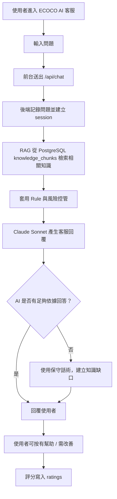
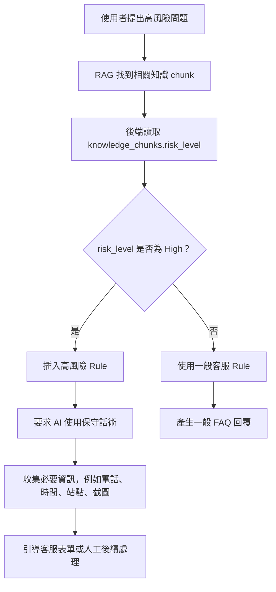
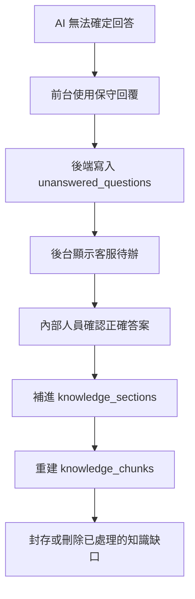
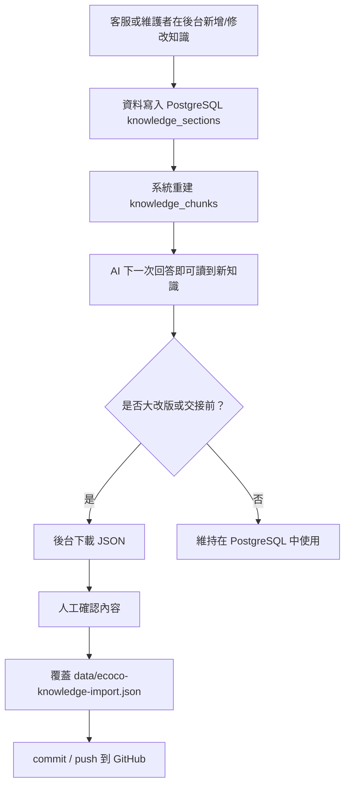

# ECOCO AI 客服 Flow 圖說明

本文件用來協助內部人員理解 ECOCO AI 客服的實際運作流程，也可以作為 Whimsical Flowchart 的繪製底稿。

## 一、Flow 圖目的

這張 Flow 圖要回答三個問題：

1. 使用者提問後，AI 客服如何產生回答。
2. 知識庫、RAG、Rule 與 Claude 分別負責什麼。
3. 當 AI 無法確定或遇到高風險問題時，系統如何處理。

## 二、建議用 Swimlane 畫法

在 Whimsical 建議畫成 5 條泳道：

| 泳道 | 代表角色 |
| --- | --- |
| 使用者 | 提出問題、收到 AI 回覆、評分 |
| 前台客服頁 | 顯示訊息、送出問題、呈現回答 |
| 後端 API | 驗證、檢索知識、呼叫模型、寫入紀錄 |
| AI 與知識庫 | RAG 檢索、Rule 控管、Claude 產生回答 |
| 後台維護 | 查看對話、補知識缺口、維護知識庫 |

## 三、主要客服流程



## 四、高風險問題處理流程

高風險問題包含點數未入帳、補點、退款、優惠券兌換、帳號、個資、客訴、機台異常等。這類問題不能讓 AI 直接承諾已補點、已退款、已處理或工程師已完成維修。



## 五、知識缺口處理流程

知識缺口不是錯誤清單，而是「AI 目前沒有足夠資料可以確定回答」的待補事項。



## 六、知識庫維護流程



## 七、Whimsical 畫圖步驟

1. 開啟 Whimsical，建立 Flowchart。
2. 建立 5 條泳道：使用者、前台客服頁、後端 API、AI 與知識庫、後台維護。
3. 先畫「主要客服流程」，從使用者提問開始，到 AI 回覆與評分結束。
4. 在中間加入判斷節點：「AI 是否有足夠依據回答？」。
5. 另外拉出兩條分支：「高風險問題」與「知識缺口」。
6. 用不同顏色標示：
   - 一般流程：藍色
   - 高風險管控：橘色
   - 人工維護：綠色
   - 資料庫或知識庫：灰色

## 八、可直接貼進 Whimsical 的簡化文字

```text
使用者提問
→ 前台送出 /api/chat
→ 後端接收問題
→ RAG 從 PostgreSQL knowledge_chunks 找相關知識
→ 讀取 risk_level 與 response policies
→ Claude Sonnet 產生回答
→ 判斷是否有足夠依據
   → 有：回覆使用者
   → 沒有：保守回覆 + 建立知識缺口
→ 使用者評分
→ 後台查看對話、評分、知識缺口
→ 內部人員補知識庫
→ 重建 chunks
→ 大改版或交接前下載 JSON 回寫 GitHub
```

## 九、給非技術人員的說法

ECOCO AI 客服不是單純把問題丟給 AI。它會先從 ECOCO 的正式知識庫找資料，再用 Rule 限制 AI 的回答邊界，最後才產生回覆。遇到不確定或高風險問題時，AI 不能亂承諾，必須保守回答並留下待補資料，讓客服或內部人員後續維護。
