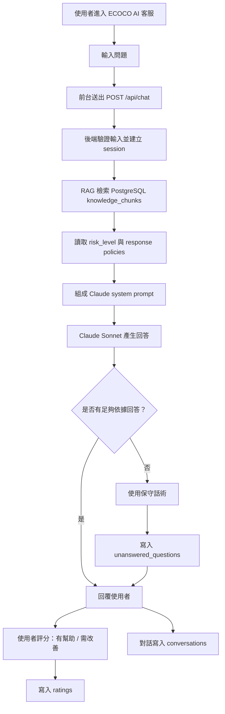
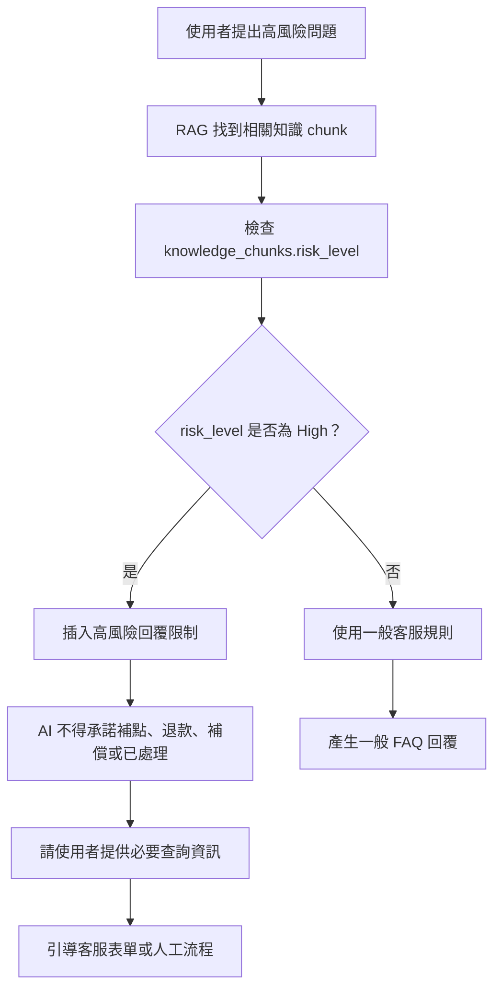
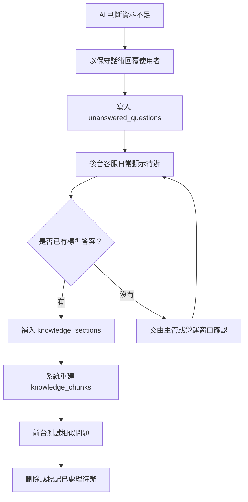
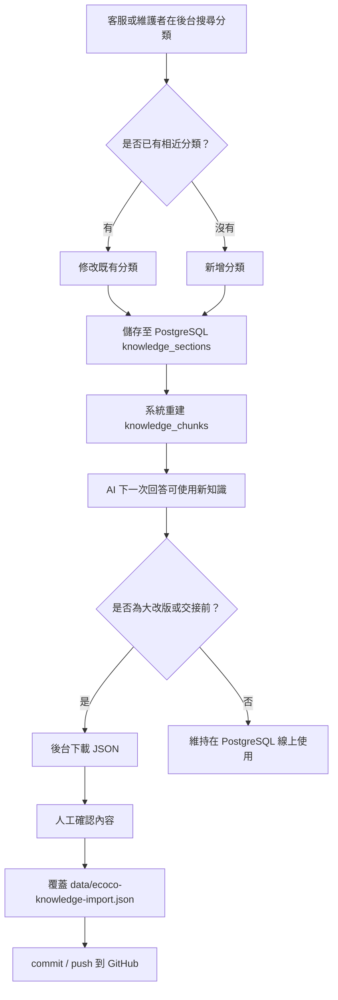

# ECOCO AI 客服流程說明

本文件說明 ECOCO AI 客服的主要流程，供客服、主管、營運與系統維護者理解：使用者提問後，系統如何查找 ECOCO 知識庫、套用客服規則、產生回答、紀錄知識缺口，並回到後台維護流程。

建議搭配 [CUSTOMER_ROLLOUT_GUIDE.md](CUSTOMER_ROLLOUT_GUIDE.md) 與 [LINE_ROLLOUT_CHECKLIST.md](LINE_ROLLOUT_CHECKLIST.md) 使用。

## 0. 對主管與客服的重點摘要

- AI 不會直接自由回答，而是先查 ECOCO 知識庫。
- 補點、退款、帳號、客訴、機台異常等高風險問題，AI 只能保守回覆並引導人工流程。
- AI 無法確認的問題會形成知識缺口，供客服或營運後續補資料。
- 後台修改會立即寫入 PostgreSQL，重大更新或交接前才需要下載 JSON 回寫 GitHub。
- LINE@ 是預留入口，正式串接後仍共用同一套知識庫與規則。

## 1. 文件目標

本文件需說明：

1. 使用者提問後，AI 客服如何產生回答。
2. PostgreSQL、RAG、Rule、Claude 分別負責什麼。
3. AI 不確定或遇到高風險問題時，系統如何保守處理。
4. 客服人員如何從知識缺口回補知識庫。
5. 大改版或交接前，資料如何從 PostgreSQL 匯出回 Git JSON。

## 2. 主要角色與責任

| 角色或模組 | 代表對象 | 主要責任 |
| --- | --- | --- |
| 使用者 | ECOCO 可可粉或一般會員 | 提問、收到回答、評分 |
| 前台客服頁 | `public/index.html` | 顯示訊息、送出問題、呈現回答 |
| 後端 API | Express routes | 驗證輸入、檢索知識、呼叫模型、寫入紀錄 |
| AI 與知識庫 | PostgreSQL、RAG、Claude | 找資料、套用 Rule、產生回答 |
| 後台維護 | 客服、營運、維護者 | 查看缺口、補知識、匯出 JSON |

## 3. 主流程



## 4. 高風險問題流程

高風險問題包含點數未入帳、優惠券無法兌換、補點、退款、帳號、會員資料、機台異常、客訴與補償。



高風險限制應明確標示在圖上，避免被理解成 AI 可直接處理個案。

## 5. 知識缺口流程



知識缺口不是 AI 錯誤清單，而是知識庫維護待辦。若是個案、個資或補償判定，不應直接寫成公開知識。

## 6. 知識庫維護流程



## 7. 資料版本流程

資料版本流程需與日常客服問答分開理解。後台修改會先影響 PostgreSQL 線上資料；只有重大更新、交接或正式備份時，才由維護者整理回 Git。

```text
後台小修
  -> PostgreSQL 立即更新
  -> AI 立即可讀
  -> 不會自動進 Git

重大更新 / 交接
  -> 後台下載 JSON
  -> 人工確認
  -> 放回 data/ecoco-knowledge-import.json
  -> commit / push
  -> Render 部署或保留版本
```

## 8. 給非技術人員的說明

ECOCO AI 客服不是把問題直接丟給 AI 自由回答。系統會先從 ECOCO 的知識庫找資料，再套用客服規則與風險限制，最後才讓 Claude 產生回覆。遇到不確定或高風險問題時，AI 會保守回答並留下知識缺口，讓客服或營運人員後續補資料。
