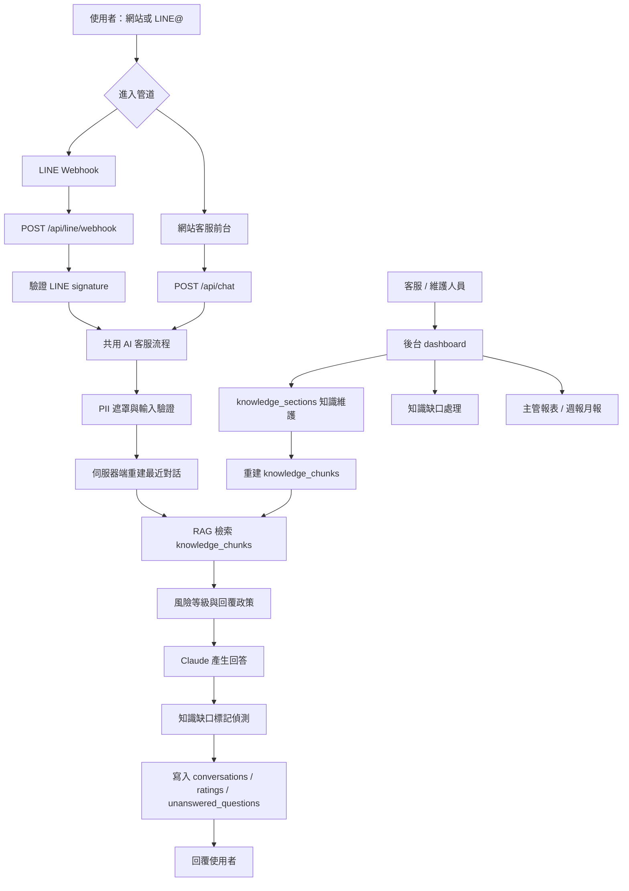
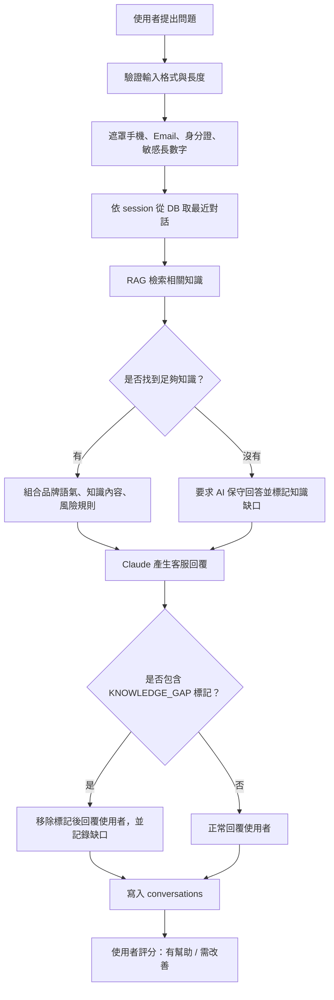
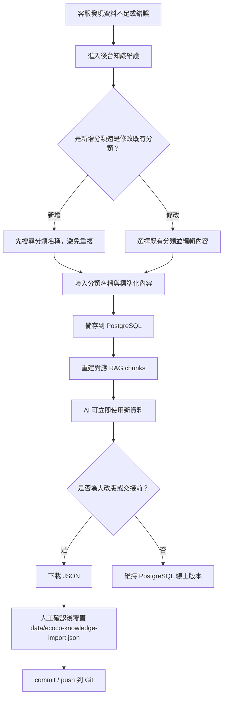
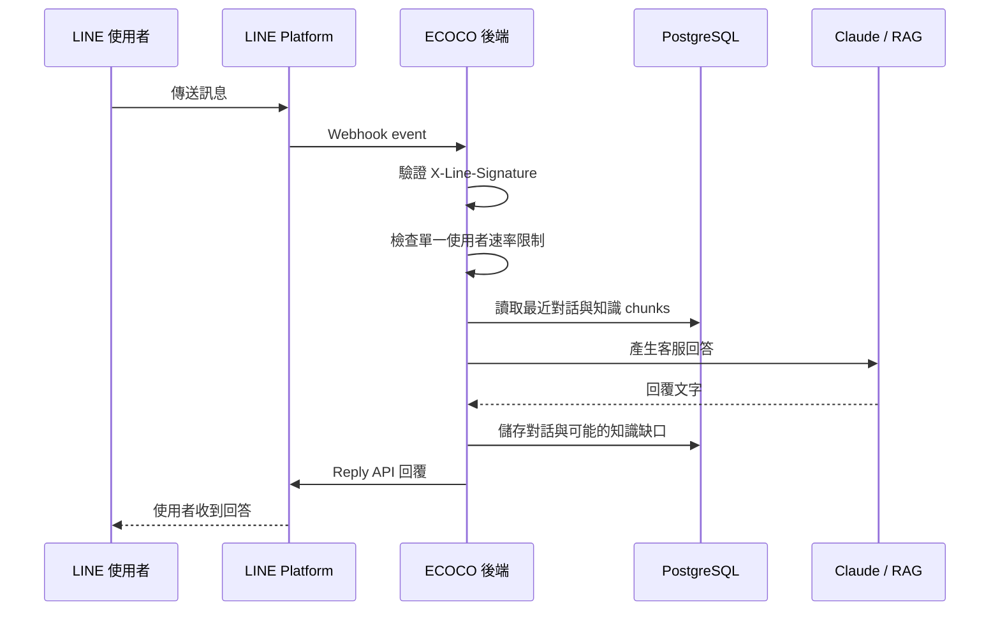

# ECOCO AI 客服系統 PRD 與流程圖

文件日期：2026-07-13  
適用專案：ECOCO AI Customer Service  
文件用途：供主管、客服、維運與後續接手人員理解系統目標、功能範圍、資料流與上線條件。

## 1. 專案摘要

ECOCO AI 客服系統是一套以 ECOCO 官方知識庫為核心的自動客服服務。系統目前支援網站客服、後台知識維護、知識缺口紀錄、使用者回饋、營運報表、LINE Webhook 串接準備、n8n 自動備份與週期健檢。

系統的核心目標不是單純做聊天機器人，而是建立一套可維護、可追蹤、可交接的客服知識管理流程。客服人員可以在後台補充知識，AI 會依據 PostgreSQL 知識庫與 RAG 檢索結果回覆使用者；當 AI 不確定時，會記錄知識缺口，讓內部人員後續補資料。

## 2. 目標與非目標

### 2.1 產品目標

- 降低常見客服問題的人工處理量。
- 讓使用者能快速查詢回收規則、點數、兌換、站點、App 使用等問題。
- 建立可持續維護的 ECOCO 客服知識庫。
- 讓客服主管能追蹤問題分類、知識缺口、使用者評分與處理狀態。
- 為 LINE Official Account 串接做好後端 Webhook 架構。
- 保留可稽核的資料更新流程，避免知識混亂或過期。

### 2.2 非目標

- 不直接承諾補點、退款、帳務處理或人工案件已完成。
- 不取代正式 CRM、Zendesk 或公司既有客服系統。
- 不在 LINE 後台重建另一套 FAQ。
- 不把內部員工訓練 Wiki 與對外客服知識混在同一個公開回答範圍。
- 不把 API key、token、客戶個資放進 Git。

## 3. 使用者角色

| 角色 | 主要需求 | 系統提供能力 |
| --- | --- | --- |
| 一般使用者 | 詢問回收、點數、兌換、站點、App 問題 | 網站客服與未來 LINE@ AI 回覆 |
| 客服人員 | 查看 AI 不確定問題、補充知識、確認常見問題 | 後台知識維護、知識缺口列表、對話紀錄 |
| 主管 / 總經理室 | 了解客服量、分類、處理狀況、改善成果 | 主管報表、週報/月報 Markdown |
| 維運 / 工程 | 部署、環境變數、資料庫、Webhook、備份 | Runbook、health check、GitHub Actions、n8n |
| 內部知識管理者 | 管理員工訓練、內部 SOP、跨部門知識 | Internal Wiki 模式，與對外客服知識分離 |

## 4. 功能範圍

### 4.1 前台 AI 客服

- 使用者輸入問題後，由後端呼叫 Claude 產生回答。
- 回答依據 PostgreSQL 知識庫與 RAG 檢索。
- 當 OpenAI embedding / pgvector 可用時，使用語意檢索；不可用時降級為關鍵字檢索。
- 回答不可顯示內部 RAG chunk、來源分數或工程資訊。
- 高風險問題採保守話術，引導使用者提供必要資訊或聯繫客服。
- 使用者可按「有幫助 / 需改善」留下評分。

### 4.2 後台知識維護

- 新增、修改、封存知識分類。
- 支援知識分類搜尋，避免重複分類。
- 修改後立即更新 PostgreSQL，AI 可使用最新知識。
- 支援下載 JSON，作為大改版或交接前同步回 Git 的正式資料來源。
- 封存資料不再進入 AI 回答，但保留資料以便追蹤。

### 4.3 知識缺口管理

- AI 判斷無法可靠回答時，會記錄到 `unanswered_questions`。
- 使用者按「需改善」也會進入待處理區。
- 後台可查看、處理或忽略知識缺口。
- 目前設計重點是讓客服人員知道「哪裡需要補資料」，不是讓 AI 自動亂補答案。

### 4.4 LINE Official Account 串接

- 預計使用 LINE Messaging API，不使用 LINE 後台 AI 聊天機器人 beta 作為主要知識庫。
- LINE 使用者傳訊息後，LINE 透過 Webhook 呼叫本系統。
- 後端驗證 LINE signature 後，走同一套 AI 客服流程。
- 回覆透過 LINE Reply API 回傳給使用者。
- LINE webhook 已加入 per-user rate limit，避免單一使用者洗頻造成 API 成本暴增。

### 4.5 n8n 與自動化

- n8n 可用於週期性呼叫 API、寄出報告、提醒維護人員。
- GitHub Actions 目前支援週期知識庫備份與 AI 分析腳本。
- 備份改為 GitHub artifact，不再每週 commit 回 repo，避免 repo 變肥與無意義部署。

### 4.6 內部 Wiki 模式

- 使用同一個 codebase，但以 `APP_MODE=internal` 啟用內部知識模式。
- 內部知識與對外客服知識分開。
- 需使用 staff key 或內部登入方式保護。
- 適合後續員工訓練、部門 SOP、內部知識查詢。

## 5. 系統架構

## 6. 客服回答流程

## 7. 知識維護流程

## 8. LINE 串接流程

## 9. 資料與系統來源

| 類型 | 位置 | 用途 |
| --- | --- | --- |
| 線上知識庫 | PostgreSQL `knowledge_sections` | AI 實際回答時讀取的主要知識 |
| RAG 片段 | PostgreSQL `knowledge_chunks` | 檢索用片段，支援 pgvector / 關鍵字 fallback |
| 對話紀錄 | PostgreSQL `conversations` | 回顧客服問題、產出報表、分析需求 |
| 評分紀錄 | PostgreSQL `ratings` | 追蹤回答品質與需改善案例 |
| 知識缺口 | PostgreSQL `unanswered_questions` | 讓客服補知識與改善 FAQ |
| 正式 Git 知識來源 | `data/ecoco-knowledge-import.json` | 大改版或交接時的版本管理來源 |
| 整合資料庫來源 | `data/ecoco-ai-customer-service-database.json` | 整合原始資料與知識分類的整理版 |
| 回覆政策 | `data/ecoco-response-policies.json` | 高風險回答規則與禁止承諾事項 |

## 10. 安全與合規要求

- API key、token、資料庫連線字串只能放在 Render / GitHub Secrets / n8n credentials。
- Git repo 不可放真實客戶手機、Email、身分證、會員資訊。
- 對話寫入資料庫前需遮罩常見個資格式。
- 後台 API 需 `x-admin-key`。
- LINE Webhook 需驗證 `X-Line-Signature`。
- 使用者對話需設定保存期限，建議 `CONVERSATION_RETENTION_DAYS=180`。
- 對外 `/healthz` 只回基本狀態，不暴露模型、RAG、同步模式等內部資訊。

## 11. 上線前條件

| 項目 | 狀態要求 |
| --- | --- |
| Render 環境變數 | `DATABASE_URL`、`ANTHROPIC_API_KEY`、`ADMIN_KEY` 必須存在 |
| OpenAI embedding | 若要語意 RAG，需設定 `OPENAI_API_KEY` |
| LINE 串接 | 需取得 `LINE_CHANNEL_SECRET`、`LINE_CHANNEL_ACCESS_TOKEN` 並設定 Webhook URL |
| PostgreSQL | schema 初始化成功，`knowledge_sections` 與 `knowledge_chunks` 可讀寫 |
| 測試 | `npm run lint`、`npm test`、`npm run scan:pii`、`npm audit` 通過 |
| 備份 | GitHub Actions artifact 或 n8n 備份流程可正常執行 |
| 監控 | 建議 UptimeRobot 或 n8n 定期打 `/healthz` |
| 知識庫 | 主要 FAQ、品牌語氣、風險政策已由內部確認 |

## 12. 成功指標

| 指標 | 說明 |
| --- | --- |
| AI 回覆量 | AI 自動處理的訊息數 |
| 知識缺口數 | AI 無法回答或使用者負評的問題數 |
| 缺口處理率 | 已補知識 / 已忽略 / 待確認比例 |
| 使用者評分 | 有幫助與需改善比例 |
| 熱門分類 | 回收規則、點數、優惠券、站點、App 等問題分布 |
| 維護週期 | 客服多久更新一次知識庫 |
| LINE 啟用後流量 | LINE 來源訊息量與網站來源訊息量比較 |

## 13. 後續優化建議

1. 建立 golden set，固定抽 20 到 30 題測試 AI 回覆品質。
2. 將 `/healthz` 接到 UptimeRobot 或 n8n，系統異常時自動通知。
3. LINE 正式上線前，先以測試帳號或測試 channel 驗證 Webhook。
4. 定期下載 JSON 回寫 Git，避免 PostgreSQL 線上資料與 Git 正式版本落差太大。
5. 內部 Wiki 建議獨立 Render service，以 `APP_MODE=internal` 運行，避免內部知識誤進對外客服。
6. 若客服量提高，需評估 Render 方案、PostgreSQL 方案與 Claude/OpenAI 成本。

## 14. 一句話報告版本

本專案已完成 ECOCO AI 客服的主要架構，包含網站客服、PostgreSQL 知識庫、RAG 檢索、Claude 回覆、知識缺口紀錄、後台維護、主管報表、LINE Webhook 串接準備、n8n / GitHub Actions 備份與週期健檢。下一步若要正式接 LINE@，需要公司提供 LINE Developers Messaging API 權限與正式 API key，並完成測試 channel 驗證後再切正式流量。
